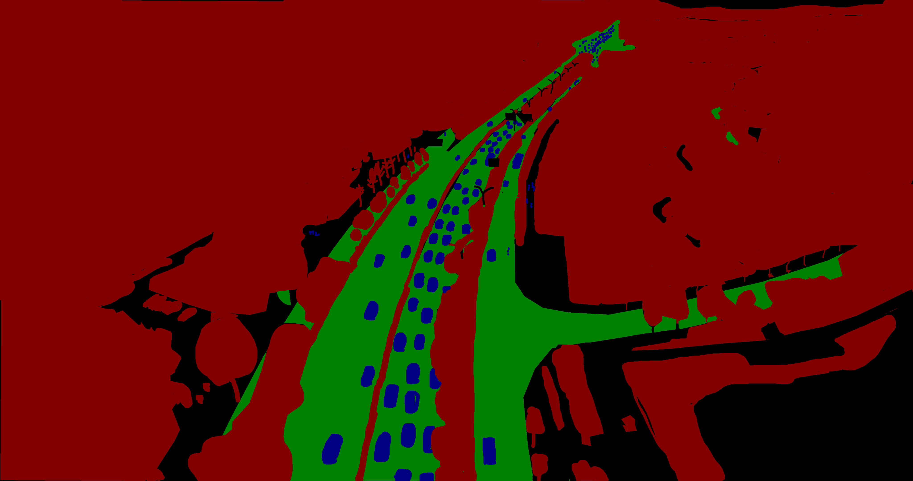

# Semantic_Segmentation_UAVid

This project contains a full pipeline of training and inferring of UAVid dataset using three different models (SegFormer,UnetFormer,Feature Pyramid) models for image segmentation using Pytorch-Lightning. \
This project uses ensemble learning to achieve the task.

- I have used pytorch 2.0 and pytorch-lightning 2.0 as a framework to the networks.

A sample result can be seen here:
Image:


Prediction:
- Red : Static Class
- Green : Road Class
- Blue : Dynamic Class
- Black : Clutter Class


Ground Truth Mask:


## Install

You can install using the following commands:
```
conda create -n uavid python=3.9
conda activate uavid
pip install torch torchvision --index-url https://download.pytorch.org/whl/cu118
git clone https://github.com/maliksyria/Semantic_Segmentation_UAVid.git
cd Semantic_Segmentation_UAVid
pip install -r requirements.txt
```

## Folder Structure

This repository with dataset is recommended to be organised in the following structure:
```

├── config (Configuration files for each model)
├── docker (Dockerfile needed to build the Docker image with required dependencies)
├── model_weights (Model weights trained on UAVid dataset)
├── src (Models and dataset source code)
├── utils (Tool files)
├── uavid
│   ├── uavid_train (Original dataset)
│   │   │   ├── seq1
│   │   │   │    ├── Images
│   │   │   │    ├── Labels
│   ├── uavid_val (Original dataset)
│   │   │   ├── seq16
│   │   │   │    ├── Images
│   │   │   │    ├── Labels
│   ├── uavid_test (Original dataset)
│   ├── train (Relabeld and processed dataset)
│   │   ├── images
│   │   ├── masks
│   ├── val (Relabeld and processed dataset)
│   │   ├── images
│   │   ├── masks
├── inference.py
├── requirements.txt
├── train.py
```

## Models 
This repository contains three architectures:

- SegFormer 
- UNetFormer
- Feature Pyramid Network 

You can add your own architecture by add a new config file in [config folder](config/), and add a Pytorch-Lightning Module in [lightning_module folder](src/lightning/)


Pretrained Weights of models on UAVid can be downloaded from [Yandex Disk](https://disk.yandex.ru/d/AINrvKNrpEjjpQ)

## Data Preprocessing
You can download the dataset from [Kaggle](https://www.kaggle.com/dasmehdixtr/uavid-v1).

And then we need to **relabel** it and **split** it into patches of 1024*1024 each using: 

```
python utils/uavid_patch_split.py \
--input-dir "./uavid/uavid_train" \
--output-img-dir "./uavid/train/images" \
--output-mask-dir "./uavid/train/masks" \
--split-size-h 1024 --split-size-w 1024 \
--stride-h 1024 --stride-w 1024
```
- ```uavid``` dataset folder supposed to be inside the repo. folder. 
- Please do so for both train and val sets. Please be patient, this process takes time.

## Training
For training, you only need to adjust your config file and pass it to train file

```-c``` the path of the python config file, use different **config** to train different models.

P.S. : Please login into your WandB account to log results. 
```
python3 train.py -c config_file.py
```

## Inference
The inference supposes that you pass one or more models with their correspondent weight in the ensemble learning. 
This is an example of running the three models together 

```-i``` input path 

```-c```  path of the config files of models. You may use one or more

```-w```  weight for each config file (for each model) (the "importance" of the model in the ensemble learning) 

```-o``` output path 

```-b``` batch size

```-m``` flag whether the set has masks or not (test set does not have masks to evaluate on)

An example of inferring only on SegFormer:
```
python3 inference.py \
-i ./uavid/uavid_val \
-c ./config/Segformer.py \
-w 1 \
-o ./results/ \
-ph 1024 -pw 1024 \
-b 6 \
-m 
```

An example of inferring on the three models together:
```
python3 inference.py \
-i ./uavid/uavid_val \
-c ./config/Unetformer.py ./config/Segformer.py ./config/FPN.py \
-w 0.33 0.33 0.33 \
-o ./results/ \
-ph 1024 -pw 1024 \
-b 6 \
-m 
```


## Docker 

This docker image based on Ubuntu 20.04, cuda11.8, PyTorch 2.0 with Python 3.9. It contains models' weights.

**Install Docker**

```
sudo apt install docker.io
```

To use the provided docker you also should have [NVIDIA Container Toolkit](https://github.com/NVIDIA/nvidia-docker) on the host machine.

**Build**
```
cd Semantic_Segmentation_UAVid/docker
docker build -t semantic_uavid:last .
```

**Run**

To run it make sure to mount the dataset from your local machine into docker container by ```-v``` argument
``` 
docker run -it \
--ipc=host \
 -v ./uavid:/workspace/uavid \
 --gpus all \
 semantic_uavid:last
```

## Jupyter notebook
A walkthrough and explanation of parts of the work can be seen in this [Notebook](Semantic_Seg_UAVid.ipynb)
## Report

A report of training process of the models can be seen [in WandB](https://wandb.ai/maliksyria/UAVid_Semantic/reports/Semantic-Segmentation-of-UAVid-Dataset--Vmlldzo0NDU1MTEy)

## TODO List
- ~~Create Jupyter Notebook as a demo of the work~~
- ~~Create docker~~
- ~~Test Time Augmentation (TTA) implementation~~
- ~~More explanation of architectures in notebook~~